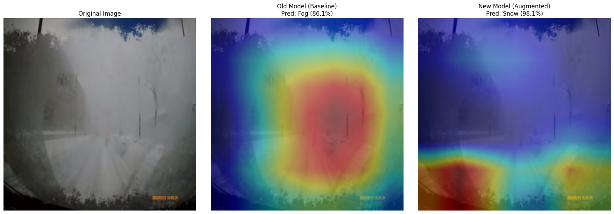
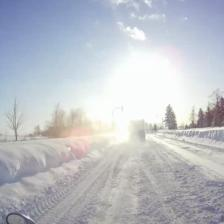
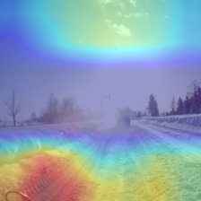

# Road Surface Condition Classifier (ResNet18)

[](https://www.python.org/)
[](https://pytorch.org/)
[](https://www.docker.com/)
[](https://onnx.ai/)

車載カメラ画像から路面状況（積雪・雨・霧・夜）を判定するAIプロトタイプです。
単なる精度の追求にとどまらず、**「説明可能AI（XAI）」を用いたモデルの妥当性検証**と、**「実運用を見据えた環境最適化」**に注力しました。

---

## 🌟 プロジェクトのハイライト

1.  **データ拡張によるロバスト性の向上**:
    - `GaussianBlur`や`ColorJitter`等を採用。フロントガラスの汚れや地吹雪等のノイズに対する耐性を強化し、旧モデルで発生していた「画面全体の白さを霧（Fog）と誤認する」問題に対処。
2.  **マルチプラットフォーム最適化 (ONNX)**:
    - PyTorchに依存しないONNX形式への変換を実装。エッジデバイスやC++等の異言語環境へのデプロイを可能にし、推論のポータビリティを確保。
3.  **XAI（Grad-CAM）による推論根拠の可視化とデバッグ**:
    - AIが「どこを見て」判定したかをヒートマップで可視化。環境間の推論誤差を特定し、論理的な改善サイクルを回すプロセスを構築。
4.  **リソースの最適化**:
    - 元データ約7GBを、精度を維持したまま40MB（約1/175）まで軽量化。学習・ストレージコストを大幅に削減。
5.  **コンテナ化による環境再現性**:
    - Dockerを採用。OSやライブラリの依存関係を排除し、あらゆる環境で即座に同一の推論結果を得られる基盤を構築。

---

## 🔍 Grad-CAMによる失敗分析と改善

「フロントガラスに雪が張り付いた画像」を用いた、改善前後の比較分析結果です。

| 項目 | 初期モデル (Baseline) | 改善モデル (Augmented) |
| :--- | :--- | :--- |
| **判定結果** | **Fog (確信度 86.1%)** | **Snow (確信度 98.1%)** |
| **注視点 (赤い領域)** | **画像中央の白い発光部分** | **路面上のタイヤ痕（直線的特徴）** |
| **技術的考察** | 画面全体の「白さ」を霧と誤認する**ショートカット学習**が発生。路面を無視していた。 | ノイズを無視し、路面の本質的なテクスチャを捉えるように**汎化性能が向上**。 |



---

## 🛠 技術的考察：推論ドリフトの特定と「文脈欠落」の課題

本番想定環境（ONNX Runtime）での検証において、前処理ロジックを厳密に統一したことで見えてきたモデルの新たな課題について分析を行いました。

**課題: CenterCropによる判定精度の変化** 推論環境に合わせて「中央224pxの切り抜き」を厳密に適用したところ、広域の雪景色を「Rain」と誤判定する事象を確認。

**分析結果：局所テクスチャへの依存**
1. **注視点の特定**: Grad-CAMによる解析の結果、AIは「画像下部の積雪エリア」を注視していることを確認しました。
2. **誤判定のメカニズム**:
   - 切り抜きにより、空や周囲の景色といった「冬の景観」という大局的な文脈（Global Context）が消失。
   - その結果、AIは視界内の**「積雪表面のテクスチャ（ざらつきや光沢）」のみを根拠に判断**せざるを得なくなり、それが「雨で濡れた路面の質感」と統計的に類似していたためにRainと誤認したと推察されます。
3. **結論**: 実務レベルの信頼性確保には、局所的な形状（轍など）を捉える能力の強化や、より広い視野を維持した入力設計の重要性を特定しました。

| 分析用入力画像（CenterCrop後） | Grad-CAMによる注視点可視化 |
| :---: | :---: |
|  |  |
| *文脈が切り取られた限定的な視界* | *積雪部分を注視しつつもRainと誤答* |

---

## 📂 ディレクトリ構成

```text
.
├── app/
│   ├── main.py              # Docker用推論実行スクリプト
│   └── models/
│       ├── road_model_augmented.pth # PyTorch学習済み重み
│       └── road_model.onnx   # 最適化済みONNXモデル
├── scripts/
│   ├── export_onnx.py       # ONNX変換用スクリプト
│   ├── inference_onnx.py    # ONNX Runtimeによる軽量推論テスト
│   ├── gradcam_with_crop.py # 厳密な検証用Grad-CAM分析
│   ├── resize_images.py     # データ前処理・軽量化スクリプト
│   └── analyze_gradcam.py   # XAI分析用スクリプト
├── results/                 # XAI解析結果・証拠画像
├── Dockerfile               # 実行環境定義
├── requirements.txt         # 依存ライブラリ
└── README.md

```

## 🚀 実行方法

**A. Docker環境 (PyTorch)**

```bash
docker build -t road-ai .
docker run --rm -v $(pwd)/test_images:/data road-ai /data/sample_image.jpg
```

**B. ローカル環境 (ONNX Runtime)**

PyTorch等の重いライブラリを必要とせず、軽量なエンジンのみで推論が可能です。

```bash
python scripts/inference_onnx.py
```

---

## 🛠 技術スタック

- **Framework**: PyTorch / Torchvision (ResNet18)
- **Optimization**: ONNX, ONNX Runtime
- **Infrastructure**: Docker
- **Library**: OpenCV (Interpretation), NumPy, Pillow (Preprocessing), Matplotlib
- **Environment**: Google Colab (Training) / Local Windows (Development)
- **XAI**: Grad-CAM (Gradient-weighted Class Activation Mapping)

---

## ⚠️ 現在の課題と実運用に向けた考察 (Limitations & Challenges)

本プロトタイプの実機テストにおいて、特定の条件下での誤判定（夜間の雪道をNightと判定、吹雪をFogと判定等）を確認しています。これに対し、実務レベルでは以下の改善アプローチが有効であると分析しています。

1. **クラス定義の多層化（Multi-label Classification）**:
   - 現在の「4クラスから1つを選択」する形式から、「時間帯（Day/Night）」と「路面状況（Snow/Rain/Dry）」を独立して判定するマルチラベルモデルへの移行。
2. **ドメイン適応の強化**:
   - 吹雪と霧の識別を強化するため、より高周波なエッジ特徴を強調する前処理フィルタの導入、または特定気象に特化したデータセットの追加学習。
3. **推論の安定化（時系列データの活用）**:
   - 単一フレームでの誤認識を吸収するため、動画ストリーム（LSTM等）の活用や、過去数秒間の判定結果から移動平均をとるロジックの実装。
4. **フェイルセーフと業務ロジックの実装**: 
   - Confidence Score（確信度）が僅差・閾値以下の場合に「判定不能」を返して他センサーへ判断を仰ぐ、あるいは安全側の判定（Snow）を優先出力する仕組みの導入。